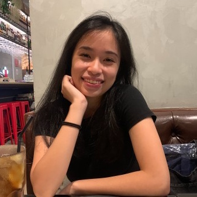
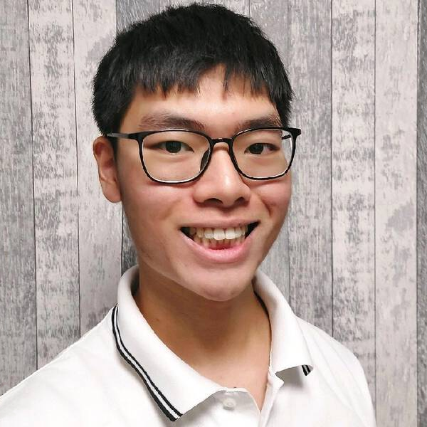
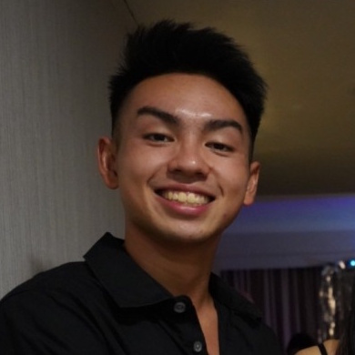
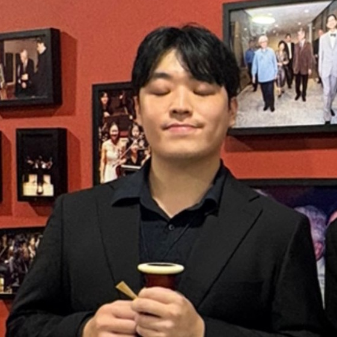

We are a team based in the [School of Computing, National University of Singapore](https://www.comp.nus.edu.sg).

You can reach us at the email `seer[at]comp.nus.edu.sg`

## Project team

### Cheryl Chow Han Lin

* Role: -
* Responsibilities: -

### Chia Kei Pei

* Role: -
* Responsibilities: -

### Lee Zong Xun Renfred

* Role: -
* Responsibilities: -

### Ng Zhang Zhe, Ryan

* Role: -
* Responsibilities: -

### Yang Joonwon

* Role: -
* Responsibilities: -

### John Doe

[[homepage](http://www.comp.nus.edu.sg/~damithch)]
[[github](https://github.com/johndoe)]
[[portfolio](team/johndoe.md)]

* Role: Project Advisor